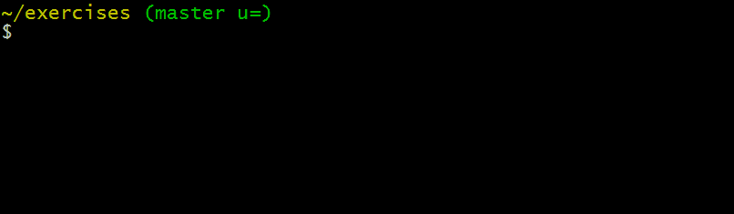

# exercices git


Ce dépôt contient le code source de la plateforme [git-exercises](https://gitexercises.fracz.com/) pour pratiquer git.




## Overview

This project consists of two docker images: mysql and an apache server.

## Setup

*Windows 10*:
```
Docker desktop community 2.3.0.3
    - docker-compose version 1.25.5, build 8a1c60f6
    - Docker version 19.03.8, build afacb8b
MySQL Workbench 8.0
```

*Ubuntu 18.04.5*:
```
docker-compose version 1.17.1, build unknown
Docker version 19.03.6, build 369ce74a3c
mysql-client-core-5.7
```

## Configuration

The only file you need to update is `docker/.env`

## How to build

In directory `/docker` run
```
docker-compose build
```

Make sure the default branch of your repo is `verifications`

## How to run

In directory `/docker` run
```
docker-compose run
```

## Database schema initialization

First time you need to run `backend/schema/gitexercises.sql`

To execute these instructions do

```bash
# login to mysql running in docker container
mysql -h localhost -P 3306 --protocol=tcp -u root 
# in mysql shell 
CREATE DATABASE <DB_NAME as defined in docker/.env>;
USE <DB_NAME as defined in docker/.env>;
# run the sql file
source 'backend/schema/gitexercises.sql'

```

## Start exercising

Assuming you run on localhost, this is how you start with exercise 1

```bash
git clone http://localhost/git/exercises.git git-exercises
cd git-exercises
./configure.sh
git start
```

## Adding new exercises

See [CONTRIBUTING.md](CONTRIBUTING.md)
